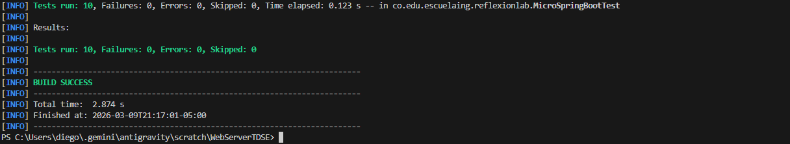
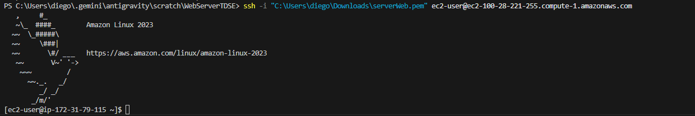
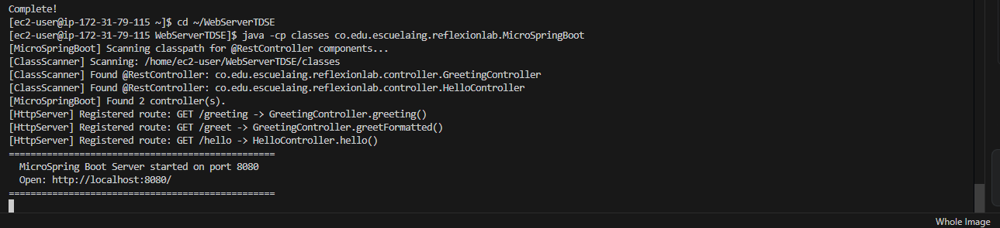
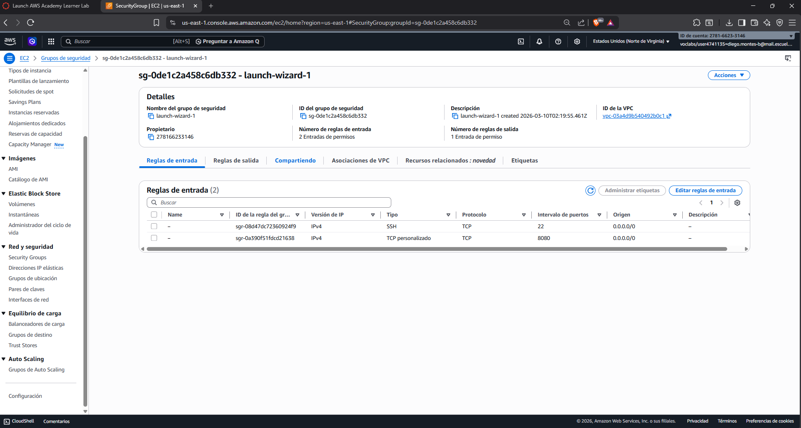
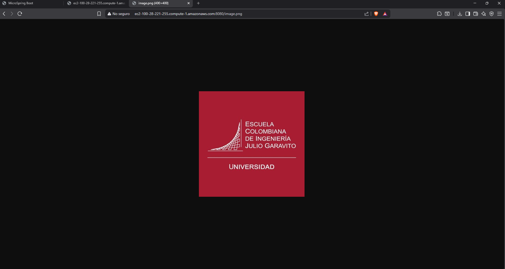

# Taller de Arquitecturas de Servidores de Aplicaciones - Framework IoC y Servidor Web

## Introduccion
Este proyecto fue desarrollado como prototipo minimo para el curso de Arquitecturas de Servidores de Aplicaciones. Los objetivos principales son:

1. Construir un servidor Web tipo Apache en Java Puro (sin utilizar frameworks web de alto nivel) capaz de entregar paginas HTML e imagenes PNG, y atender multiples solicitudes de forma no concurrente.
2. Demostrar las capacidades reflexivas de Java construyendo un framework de Inversion de Control (IoC) minimo para extraer informacion de POJOs anotados y derivar una aplicacion web a partir de ellos.

---

## Diseno y Arquitectura
La solucion propuesta se divide en tres componentes arquitectonicos coherentes y modulares:

1. **Servidor HTTP Core:** 
   Implementado usando hilos basicos y `ServerSocket` para escuchar en el puerto designado (8080). Encargado de parsear la linea de Request HTTP (soportado explicitamente GET), dividiendo la ruta de los parametros de formato de busqueda HTTP (Query params). Decide dinamicamente si cederle el bloque a un recurso dinamico resuelto por el framework inverso, o servir estaticamente un archivo del disco de recursos.

2. **Framework IoC por Meta-Protocolos:** 
   El nucleo reflexivo. Utiliza un `ClassScanner` de utilidades capaz de recorrer el arbol de origenes y directorios del classpath, localizando activamente las clases anotadas con la directiva `@RestController`. Al iniciarse el servidor, instanciara cada endpoint, explorando individualmente los metodos firmados con `@GetMapping` para enrutarlos y extraer los requerimientos de la peticion mapeando parametros default si es pertinente el atributo (mediante `@RequestParam`).

3. **Aplicacion Web de Ejemplo:** 
   Constituye el conjunto de POJOs simples elaborados y recursos web interactivos que consumiran y pondran a prueba los servicios provistos para verificar operacion continua y enrutado correcto sin acoplarse con la logica primaria del servidor HTTP.

---

## Que se implemento

### Servidor HTTP Minimo
- Puerto 8080 por defecto de escucha HTTP/1.1.
- Soporta procesamiento nativo del verbo `GET`.
- Entrega recursos estaticos mapeados desde el subdirectorio base `src/main/resources/static`.
- Tipos MIME procesados y despachados con un Header limpio: `text/html`, `image/png`, `text/css`, `application/javascript`, `image/jpeg`, etc.
- Invocacion de metodos de instancia en caliente con conversion a subtipos limitados al retorno `String` dictado en los requerimientos del taller primario.

### Framework IoC por Reflexion Java
Anotaciones estandar implementadas:

- `@RestController`: Etiqueta Target Class para descubrir e interpretar componentes elegibles para su carga autonoma por el contenedor IoC interno del Servidor.
- `@GetMapping("ruta")`: Marca de metodo permitida para enrutar una URI a funcionalidad de backend.
- `@RequestParam(value, defaultValue)`: Anotacion aplicada a parametros de metodos expuestos capaz de mapear queries URL-Encoded del lado del cliente, cubriendo con el `defaultValue` cualquier omision.

Modos de ejecucion contemplados:
- **Carga de Contexto Explicita:** Ejecutable al estilo de entornos basicos como frameworks de Test, pasando como argumento de ejecucion final la clase completamente cualificada por la terminal.
- **Auto-Escaneo (Classpath general):** Funcionalidad mas cercana al Springboot Moderno; al ejecutarse autonomamente, mapea el directorio y construye la tabla de rutas.

### Archivos Relevantes
- `src/main/java/.../MicroSpringBoot.java` // Entry Point General
- `src/main/java/.../HttpServer.java` // Logic Layer HTTP Dispatcher
- `src/main/java/.../ClassScanner.java` // System Class Directory Traverser
- `src/main/java/.../annotation/RestController.java` // Definicion Runtime Meta-Type
- `src/main/java/.../annotation/GetMapping.java` // Definicion URIMetadata Endpoint
- `src/main/java/.../annotation/RequestParam.java` // Definicion URI Extraction Parameter
- `src/main/java/.../controller/GreetingController.java` // Test Bean implementando todo
- `src/main/java/.../controller/HelloController.java` // Test Bean index
- `src/main/resources/static/index.html` // Web UI index
- `src/main/resources/static/image.png` // Multimedia check
- `src/test/java/.../MicroSpringBootTest.java` // Integration Verification Cases

---

## Requisitos de Entorno
- Entorno OS (Windows/Linux)
- Compilador Java Nativo version 11 garantizada, hasta Java 21 LTS recomendado.
- Build Tool Maven 3.x+ (manejable global).

---

## Instalacion y Uso (Ejecucion Local / Debug)

1. **Empaquetado y Compilacion Limpia**
   Desde la raiz principal con el descriptor POM.xml:
   ```bash
   mvn clean package
   ```

2. **Arranque Servidor (Modo Escaneo de Componentes Completo)**
   ```bash
   java -cp target/classes co.edu.escuelaing.reflexionlab.MicroSpringBoot
   ```

3. **Arranque Servidor (Modo Clase Explicita en la linea de comandos)**
   ```bash
   java -cp target/classes co.edu.escuelaing.reflexionlab.MicroSpringBoot co.edu.escuelaing.reflexionlab.controller.HelloController
   ```

### Accesibilidad de Endpoints
Acceso al explorador:
- Web Page Estatico Base (HTML/CSS UI): `http://localhost:8080/`
- API GET (Hello Index estatico): `http://localhost:8080/hello`
- Default query Parameter API: `http://localhost:8080/greeting`
- Custom Extractable Query Param: `http://localhost:8080/greeting?name=Esteban`
- Archivo binario estatico expuesto (Evidenciando flujos binarios): `http://localhost:8080/image.png`

---

## Evidencia de Pruebas Automatizadas

Se instrumentaron pruebas base implementando el stack `JUnit 5`. Cubren inyeccion, anotaciones, mapeo de Query Params, rutas default del servidor HTTP y detecciones directas de la capa Classloader Reflexiva.

Correr pruebas automatizadas internamente:
```bash
mvn test
```

**Resultado de Unit Tests (Evidencia):**  


---

## Despliegue en Instancia AWS EC2

Las siguientes imagenes son evidencias graficas del procedimiento completo y transparente para arrancar el entorno virtual en los servicios nube de Amazon usando EC2 como capa computacional basica aislada con redes SG.

### 1. Conexion SSH a Instancia AWS Linux / Transferencia de codigo
*(Clonado o SFTP de binarios hacia el motor computacional).*  


### 2. Ejecucion exitosa del Servidor Virtual
*(Servicio activo, despachando sub-procesos basicos en el Terminal tras arranque JVM).*  


### 3. Apertura de Networking y Reglas sobre Security Group (EC2)
*(Firewall habilitando Inbound rules externas TCP con puerta al WebServer).*  


### 4. Pruebas Funcionales usando el Public DNS Autorizado de AWS
*(Resolucion del cliente HTTP frente a peticiones enrutadas externamente por interred a AWS).*

**Retorno de Datos Estructurados HTML y Respuesta Dinamica:**  


**Comprobacion Componente Estatico PNG servido internamente:**  


---

## Conclusion
El proyecto prototipo satisface completamente el objetivo principal enmarcado para el laboratorio. Se aprovisiona satisfactoriamente a modo practico -con el uso de POJOS abstractos en lugar de estructuras acopladas Servlet nativas- la aplicacion concurrente de Meta-protocolos Reflexivos capaces de mapear en tiempo e instrumentar un sub-set web minimalista, validando su soporte base extensible con paginas visuales complejas `.html/css` y su soporte generico a transacciones binarias como PNGs. Un gran avance sentando bases de extension para integraciones en un macro-servidor de alta frecuencia o escaneo integral de dependencias JAR.
