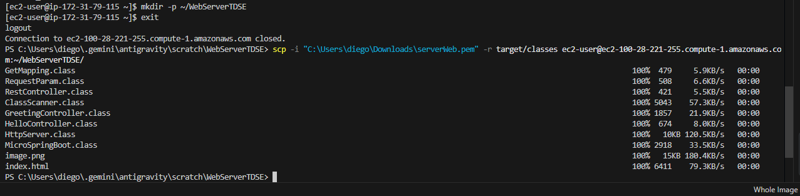
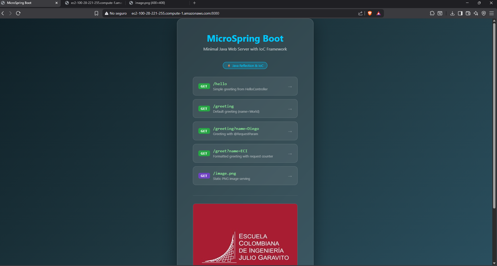
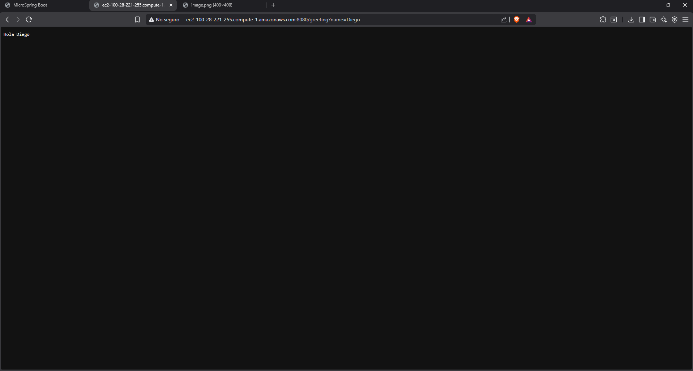

# TDSE – Servidor Web HTTP con Framework IoC Reflexivo en Java

## Introduccion

Este proyecto fue desarrollado como prototipo minimo para el taller de Arquitecturas de Servidores de Aplicaciones (TDSE), con dos objetivos centrales:

- Construir un servidor Web tipo Apache en Java puro, sin frameworks de alto nivel.
- Demostrar las capacidades reflexivas de Java para cargar POJOs anotados y publicarlos como servicios HTTP.

El servidor atiende solicitudes de manera secuencial (no concurrente) y soporta entrega de recursos estaticos (HTML y PNG).

---

## Que implementa

### 1. Servidor HTTP

- Servidor basado en `ServerSocket` en el puerto 8080.
- Soporte del metodo GET.
- Enrutamiento dinamico hacia metodos anotados con `@GetMapping`.
- Entrega de archivos estaticos desde `src/main/resources/static`.
- Tipos MIME soportados: `text/html`, `image/png`, `text/css`, `application/javascript`.

### 2. Framework IoC por reflexion

Anotaciones implementadas:

| Anotacion | Alcance | Descripcion |
|---|---|---|
| `@RestController` | Clase | Marca un POJO como componente web |
| `@GetMapping(value)` | Metodo | Asocia una ruta URI al metodo manejador |
| `@RequestParam(value, defaultValue)` | Parametro | Extrae parametros de la query string |

Capacidades:

- Carga explicita de un POJO por linea de comandos (similar a frameworks de testing).
- Escaneo automatico del classpath para detectar todas las clases con `@RestController`.
- Instanciacion via reflexion: `getDeclaredConstructor().newInstance()`.
- Invocacion reflexiva de metodos: `Method.invoke(instance, args)`.

### 3. Aplicacion web de ejemplo

Controladores incluidos:

- `HelloController` con ruta `/hello`.
- `GreetingController` con ruta `/greeting` y soporte de `@RequestParam`.
- Pagina `index.html` de navegacion entre endpoints.
- Imagen `image.png` para validar entrega de recursos estaticos PNG.

---

## Estructura del proyecto

```
WebServerTDSE/
├── pom.xml
├── .gitignore
├── README.md
└── src/
    ├── main/
    │   ├── java/co/edu/escuelaing/reflexionlab/
    │   │   ├── MicroSpringBoot.java         <- Punto de entrada / contenedor IoC
    │   │   ├── HttpServer.java               <- Servidor HTTP (ServerSocket)
    │   │   ├── ClassScanner.java             <- Escaner de classpath (Reflexion)
    │   │   ├── annotation/
    │   │   │   ├── RestController.java
    │   │   │   ├── GetMapping.java
    │   │   │   └── RequestParam.java
    │   │   └── controller/
    │   │       ├── HelloController.java
    │   │       └── GreetingController.java
    │   └── resources/
    │       └── static/
    │           ├── index.html
    │           └── image.png
    └── test/
        └── java/co/edu/escuelaing/reflexionlab/
            └── MicroSpringBootTest.java
```

---

## Requisitos

- Java 11 o superior
- Maven 3.6 o superior

---

## Como ejecutarlo

### Compilar

```bash
mvn clean package
```

### Modo escaneo automatico (detecta todos los @RestController del classpath)

```bash
java -cp target/classes co.edu.escuelaing.reflexionlab.MicroSpringBoot
```

### Modo clase explicita (como frameworks de testing)

```bash
java -cp target/classes co.edu.escuelaing.reflexionlab.MicroSpringBoot co.edu.escuelaing.reflexionlab.controller.HelloController
```

### Endpoints disponibles

| URL | Descripcion |
|-----|-------------|
| `http://localhost:8080/` | Pagina HTML estatica |
| `http://localhost:8080/hello` | Respuesta REST de `HelloController` |
| `http://localhost:8080/greeting` | Saludo con nombre por defecto (World) |
| `http://localhost:8080/greeting?name=Diego` | Saludo con `@RequestParam` |
| `http://localhost:8080/image.png` | Imagen PNG estatica |

---

## Pruebas automatizadas

Se ejecutan con:

```bash
mvn test
```

Resultado:


---

## Despliegue en AWS EC2

### Paso 1 – Subida del artefacto

```bash
scp -i "clave.pem" -r target/classes ec2-user@<PUBLIC-DNS>:~/WebServerTDSE/
```



### Paso 2 – Conexion SSH y verificacion

```bash
ssh -i "clave.pem" ec2-user@<PUBLIC-DNS>
```


### Paso 3 – Ejecucion del servidor en EC2

```bash
java -cp classes co.edu.escuelaing.reflexionlab.MicroSpringBoot
```


### Paso 4 – Reglas de entrada en Security Group

Se habilito el puerto 8080 para trafico TCP entrante desde cualquier origen.


### Paso 5 – Pruebas desde el DNS publico

```
http://<PUBLIC-DNS>:8080/
http://<PUBLIC-DNS>:8080/hello
http://<PUBLIC-DNS>:8080/greeting?name=Diego
http://<PUBLIC-DNS>:8080/image.png
```

Endpoint raiz:



Endpoint con parametro:



Recurso PNG estatico:


---

## Conclusion

El prototipo cumple el objetivo del taller: servidor web funcional con framework IoC reflexivo basado en POJOs anotados. Se implemento mapeo de rutas por anotaciones, extraccion de parametros de query string con valores por defecto, y entrega de recursos estaticos HTML y PNG.
